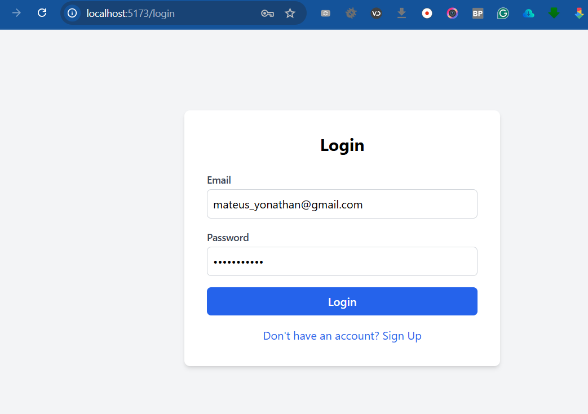
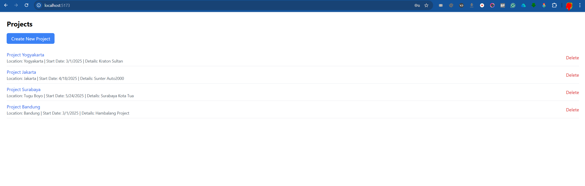
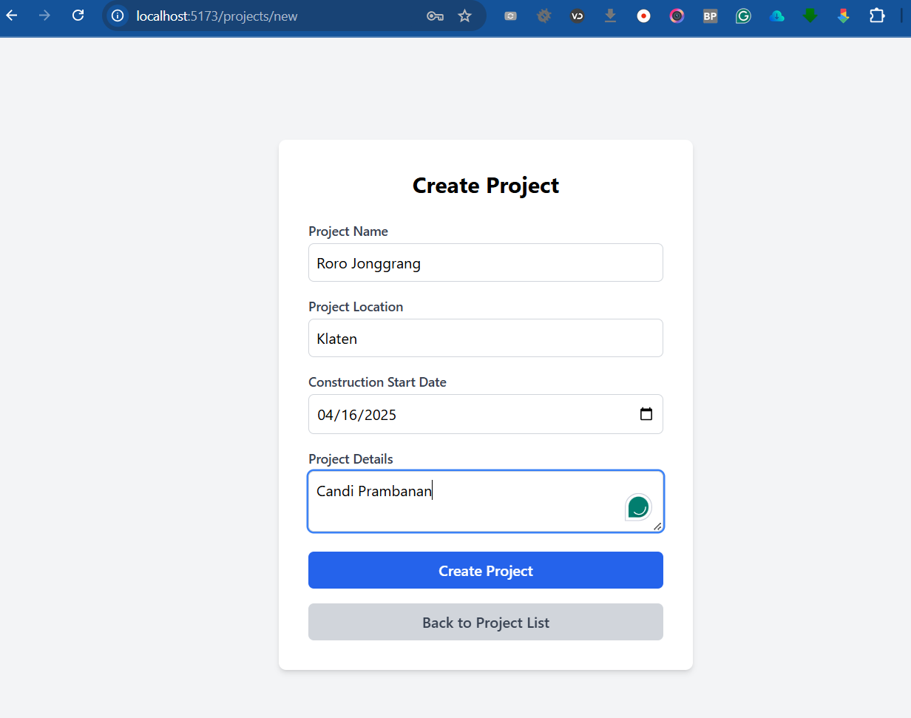
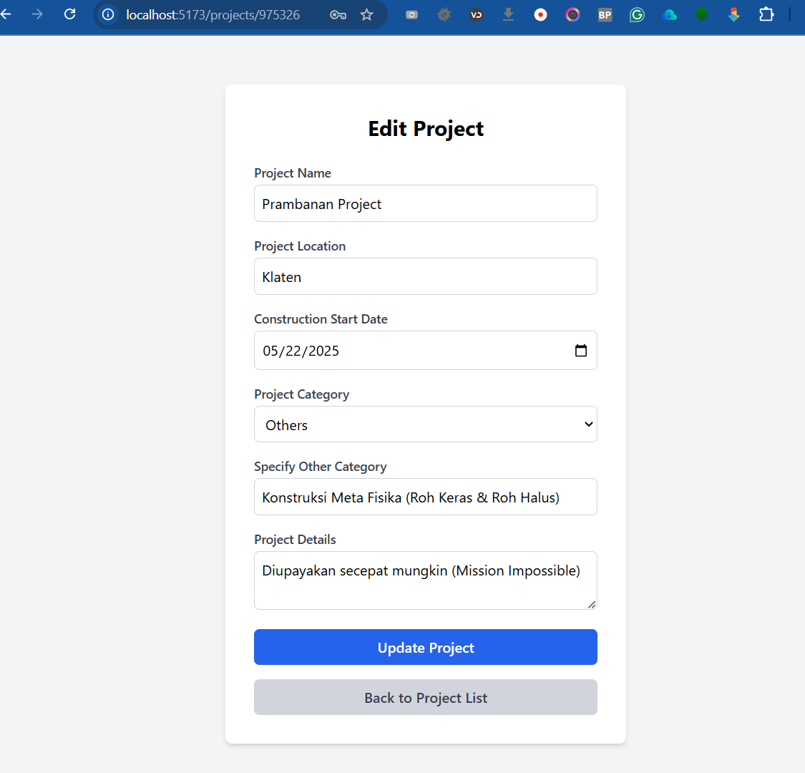
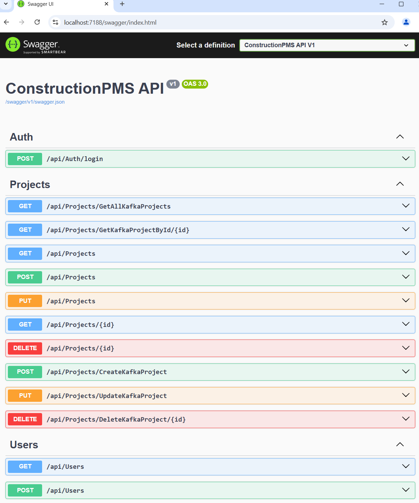

# ConstructionPMS
BCI Central

## Prerequisites
Ensure you have the following installed on your Windows system:

- [.NET Core SDK](https://dotnet.microsoft.com/en-us/download)
- [Node.js](https://nodejs.org/)
- [Vue CLI](https://cli.vuejs.org/) (`npm install -g @vue/cli`)
- [Elasticsearch](https://www.elastic.co/downloads/elasticsearch)
- [Kafka](https://kafka.apache.org/downloads)
- [Git](https://git-scm.com/)
- [Docker](https://www.docker.com/) (Optional, for Kafka and Zookeeper)

## Sample Running Application Screenshots

